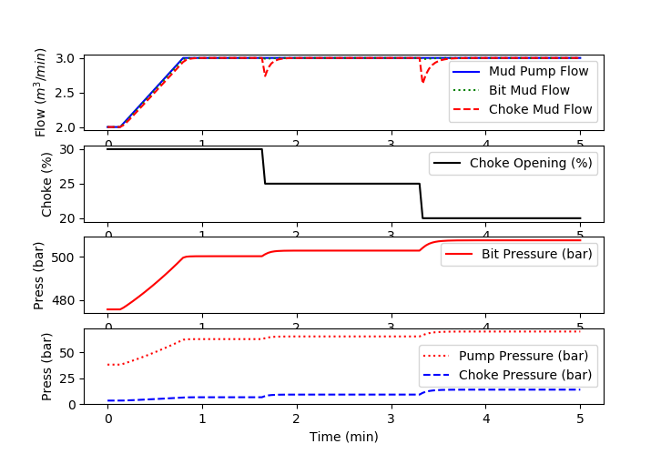
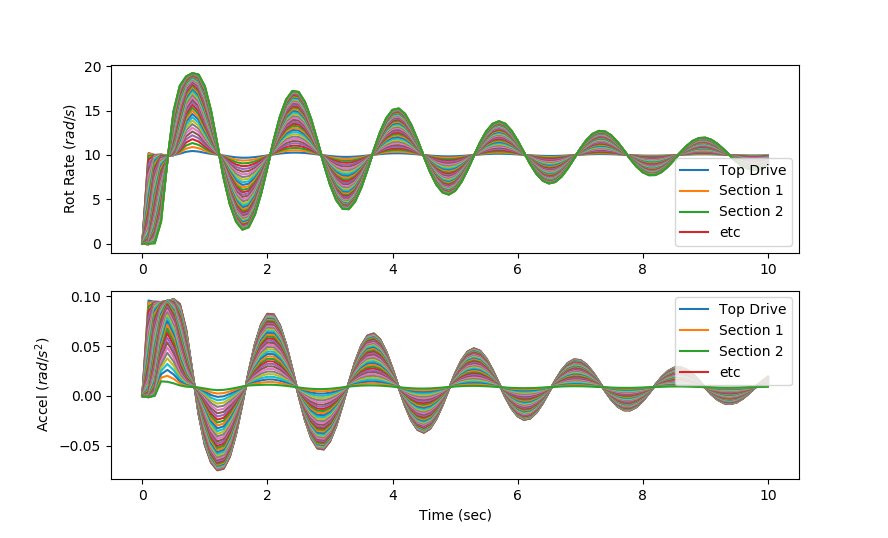

# Open Source Models for Oilfield Drilling

This repository contains open source models of oilfield drilling processes. The intent of this repository is to include self-contained code examples that are based on several sub-processes of drilling including hydraulics for pressure prediction, drill string dynamics, draw works, rate of penetration, and directional drilling. Additional models are added to the repository as the open source initiative grows. Models are in the [GEKKO Python modeling and optimization language](https://gekko.readthedocs.io/en/latest) but may also be available for other environments as well such as MATLAB. 

### Repository Contact Information
John Hedengren

Brigham Young University

[Process Research and Intelligent Systems Modeling (PRISM)](https://apm.byu.edu/prism)

john.hedengren@byu.edu

### MPD Hydraulics

Managed Pressure Drilling Hydraulic model that predicts pressure and mud flow at the bit and choke with changes in density, mud pump flow, and choke valve position.

### Soft String

Rotational vibration dynamics are predicted with a soft string model that is broken into individual string segments that include rotational inertia, frictional, and spring effects. The combination of the individual segments may be used to predict rotational vibration. Stick slip is simulated with bit boundary conditions that simulate periods of stuck bit followed by a rapid release of the stored potential energy. A soft string model does not include the effects of borehole interaction with the drill string.

### Repository Overview

This repository is in support of the open source model, data, and case study initiative as detailed in the publication, *Creating Open Source Models, Test Cases, and Data for Oilfield Drilling Challenges*, SPE-194082-MS.

### Publication
Pastusek, P., Payette, G., Shor, R., Cayeux, E., Aarsnes, U.J., Hedengren, J.D., Menand, S., Macpherson, J., Gandikota, R., Behounek, M., Harmer, R., Detournay, E., Illerhaus, R., Liu, Y., Creating Open Source Models, Test Cases, and Data for Oilfield Drilling Challenges, SPE ATCE, March 2019, SPE-194082-MS.

### Abstract
The industry has significantly improved drilling performance based on knowledge from multiple models of components and systems.  However, most new models and source code have been recreated from scratch, which adds significant research overhead with little benefit.  
The authors propose that it is time to form a coalition of industry and academic leaders to support an open source effort for drilling, to encourage the reuse of ever improving models and code.  
The vision for this guiding coalition is to 1) set up a repository for source code, data, benchmarks, and documentation, 2) submit good code, 3) review the models and data submitted, 4) use and improve the code, 5) propose and collect anonymized validation data, 6) attract talent and support to the effort, and 7) mentor those getting started.   We ask those interested to add their time and talent to the cause, and to publish their results through peer-reviewed literature. A number of online meetings are planned to create this coalition, establish a charter, and layout the guiding principles.
Several avenues have already been proposed to sustain the effort such as: annual user group meetings, creating a SPE Technical Section, and initiating a Joint Industry Program (JIP). The Open Porous Media Initiative is just one example of how this could be organized and maintained.
As a starting point, this paper reviews existing published drilling models and highlights the similarities and differences for commonly used drillstring dynamics, hydraulics and bit-rock interaction models.
Some of the key requirements for re-usability of the models and code are: 1) The model itself: open source, well documented and commented code shared in a publicly available repository, 2) A user’s guide: how to run the core software, how to extend software capabilities, i.e., plug in new features or elements, 3) A theory manual: to explain the fundamental principles, the base equations, any assumptions, and the known limitations, 4) Data: that cover a diversity of drilling operations, 5) Test cases: to benchmark the performance and output of different proposed models.  
In May 2018 at “The 4th International Colloquium on Non-linear dynamics and control of deep drilling systems”, the keynote question was; “Is it time to start using open source models…” The answer is yes.
Modeling the drilling process is done to help drill a round, ledge free hole, without patterns, with minimum vibration, minimum unplanned dog legs, that reaches all geological targets, in one run per section, in the least time possible. 
An open source repository for drilling will speed up the rate of learning and automation efforts to achieve this goal throughout the entire well execution workflow, including planning, BHA design, real-time operations, and post well analysis.

