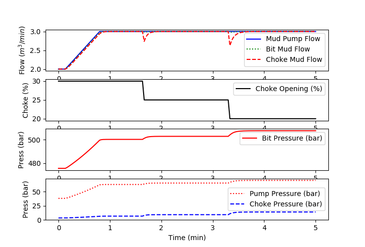

# Managed Pressure Drilling (MPD) Hydraulics

Managed Pressure Drilling Hydraulic model that predicts pressure and mud flow at the bit and choke with changes in density, mud pump flow, and choke valve position. See Asgharzadeh Shishavan [1] for additional details on the model equations and variables.

### References

1. Asgharzadeh Shishavan, R., Nonlinear Estimation and Control with Application to Upstream Processes, Dissertation, Brigham Young University, 2015. [Dissertation](https://scholarsarchive.byu.edu/etd/5291/), Pages 69-71.
